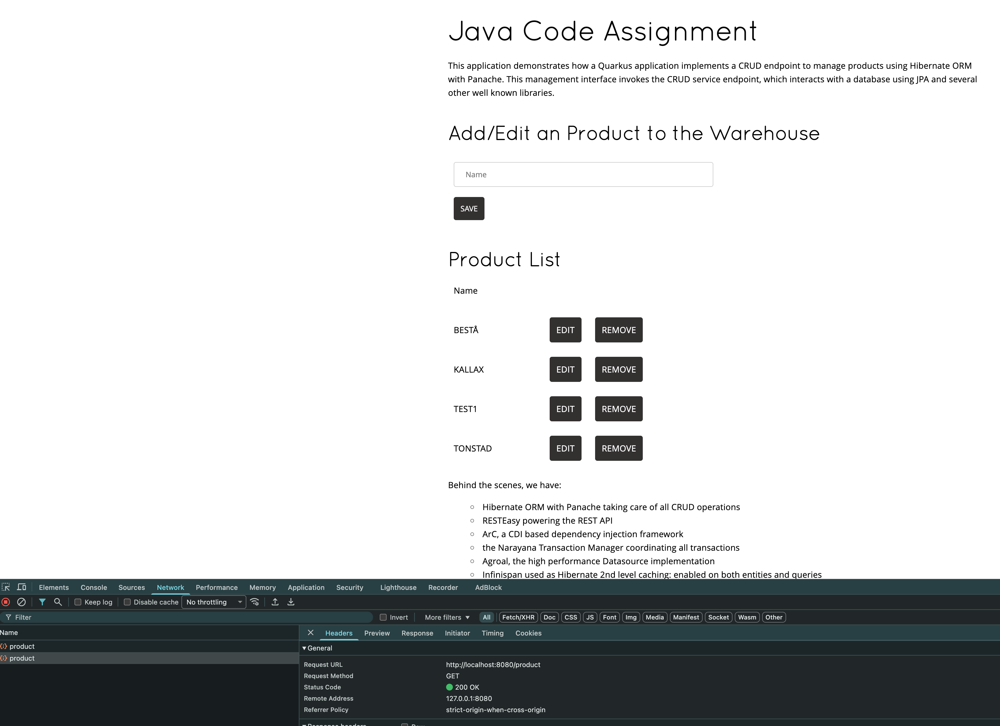
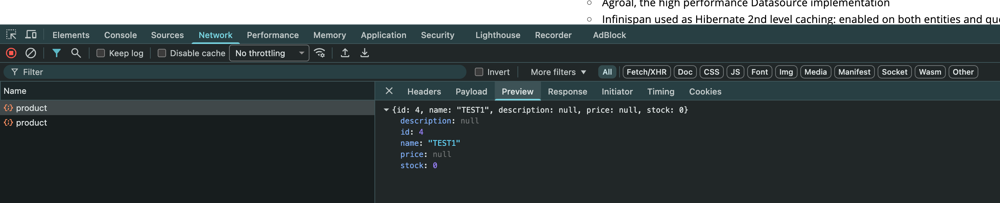
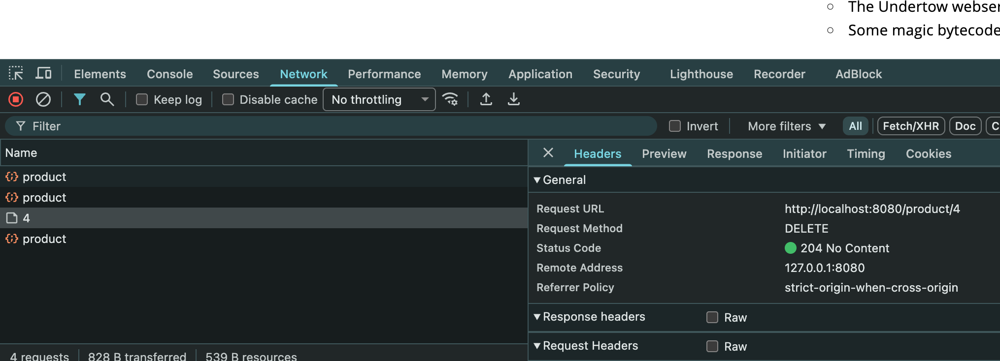
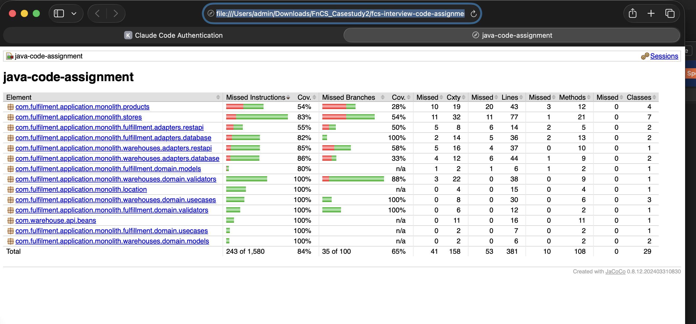
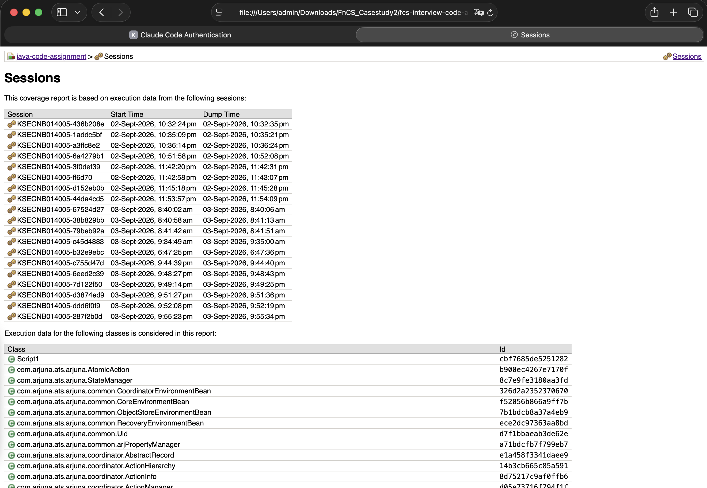
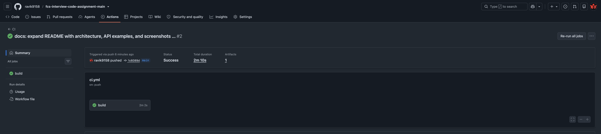

# Java Code Assignment

This is a short code assignment that explores various aspects of software development, including API implementation, documentation, persistence layer handling, and testing.

## Architecture / Project Structure

A simplified warehouse colocation management system with 4 entities — `Location` (a city, static reference data), `Store`, `Warehouse`, and `Product` — plus a `Fulfilment` association tying a `Product`, `Store`, and `Warehouse` together. See [BRIEFING.md](../case-study/BRIEFING.md) for the full domain description.

Two architectural styles are deliberately used side by side, based on how much business-rule complexity each area actually has:

- **`warehouses` and `fulfillment`** are hexagonal ("ports and adapters") — business rules live in framework-free `domain` classes, isolated behind interfaces (`ports`) from persistence/REST (`adapters`). Both have real multi-step validation (business-unit-code uniqueness, location capacity/count quotas, replace-and-archive semantics for Warehouse; duplicate-check plus 3 quota rules for Fulfilment), which is exactly the kind of logic that benefits from being testable without a database or HTTP server.
- **`stores` and `products`** are intentionally simple CRUD — no ports, no use-case layer. They have no comparable branching logic, so the extra structure would be ceremony without payoff.

```
warehouses/
  domain/models/         Warehouse, Location - plain POJOs
  domain/ports/          WarehouseStore, LocationResolver, Create/Replace/ArchiveWarehouseOperation
  domain/validators/     WarehouseValidator - all business-rule checks, isolated from orchestration
  domain/usecases/       CreateWarehouseUseCase, ReplaceWarehouseUseCase, ArchiveWarehouseUseCase
  adapters/database/     DbWarehouse (JPA entity), WarehouseRepository (implements WarehouseStore)
  adapters/restapi/      WarehouseResourceImpl (implements the OpenAPI-generated interface)

fulfillment/
  domain/models/         FulfillmentAssociation - plain POJO (storeId, productId, warehouseId)
  domain/ports/          FulfillmentStore, AssociateFulfillmentOperation
  domain/validators/     FulfillmentValidator - duplicate-check + the 3 quota rules
  domain/usecases/       AssociateFulfillmentUseCase
  adapters/database/     DbProductFulfillment (JPA entity), ProductFulfillmentRepository
  adapters/restapi/      ProductFulfillmentResource

stores/     StoreResource, Store, LegacyStoreManagerGateway, StoreCreatedEvent/StoreUpdatedEvent, LegacyStoreSyncObserver
products/   ProductResource, Product, ProductRepository
```

One deliberate boundary worth calling out: in `fulfillment`, checking that a referenced Store/Product/Warehouse *exists* (the 404 cases) stays in the REST adapter rather than being pushed through a port — those are foreign entities Fulfilment doesn't own, so existence-checking is request validation, not a Fulfilment business rule. The 4 rules Fulfilment *does* own (duplicate association, and the 3 quotas) are what live in `FulfillmentValidator`.

`Store`'s legacy-system integration uses a CDI event (`StoreCreatedEvent`/`StoreUpdatedEvent`, observed by `LegacyStoreSyncObserver` with `@Observes(during = TransactionPhase.AFTER_SUCCESS)`) rather than calling the legacy gateway directly — this guarantees the legacy system is only notified once the database transaction has actually committed, and keeps `StoreResource` from needing to know the legacy integration exists at all.

## API Usage Examples

**Create a warehouse:**
```sh
curl -X POST http://localhost:8080/warehouse -H "Content-Type: application/json" \
  -d '{"businessUnitCode":"MWH.900","location":"HELMOND-001","capacity":20,"stock":5}'
# 200 {"id":"4","businessUnitCode":"MWH.900","location":"HELMOND-001","capacity":20,"stock":5}
```

Business-rule violations return the same shape with a descriptive `error`:
```sh
# duplicate business unit code -> 400 {"error":"A warehouse with business unit code MWH.900 already exists."}
# unknown location            -> 400 {"error":"Unknown location: NOWHERE"}
# capacity below stock        -> 400 {"error":"Warehouse capacity must be at least its stock."}
# location at max warehouses  -> 400 {"error":"Location TILBURG-001 has reached its maximum number of warehouses."}
```

**Replace a warehouse** (archives the old one, creates a new one under the same business unit code):
```sh
curl -X POST http://localhost:8080/warehouse/MWH.012/replacement -H "Content-Type: application/json" \
  -d '{"businessUnitCode":"MWH.012","location":"AMSTERDAM-001","capacity":80,"stock":5}'
# 200 {"id":"5","businessUnitCode":"MWH.012","location":"AMSTERDAM-001","capacity":80,"stock":5}

# stock doesn't match the warehouse being replaced -> 400 {"error":"New warehouse stock must match the stock of the warehouse being replaced."}
# no active warehouse with that business unit code -> 404 {"error":"No active warehouse with business unit code MWH.999"}
```

**Archive a warehouse by id:**
```sh
curl -X DELETE http://localhost:8080/warehouse/1
# 204 No Content
```

**Associate a Product with a Warehouse for a Store (bonus feature):**
```sh
curl -X POST http://localhost:8080/fulfillment -H "Content-Type: application/json" \
  -d '{"storeId":1,"productId":1,"warehouseId":3}'
# 201 Created

# same association again              -> 400 {"error":"This product is already fulfilled by this warehouse for this store."}
# storeId/productId/warehouseId not found -> 404 {"error":"Store not found"}
```

## Further reading

- [QUESTIONS.md](QUESTIONS.md) - reasoning behind the persistence/API/testing design choices in this codebase.
- [../case-study/CASE_STUDY.md](../case-study/CASE_STUDY.md) - business-discussion answers on cost tracking, optimization, and budgeting for this domain.
- [../case-study/BRIEFING.md](../case-study/BRIEFING.md) - the domain briefing referenced above.

## About the assignment

You will find the tasks of this assignment on [CODE_ASSIGNMENT](CODE_ASSIGNMENT.md) file

## About the code base

This is based on https://github.com/quarkusio/quarkus-quickstarts

### Requirements

To compile and run this demo you will need:

- JDK 17+

In addition, you will need either a PostgreSQL database, or Docker to run one.

### Configuring JDK 17+

Make sure that `JAVA_HOME` environment variables has been set, and that a JDK 17+ `java` command is on the path.

## Building the demo

Execute the Maven build on the root of the project:

```sh
./mvnw package
```

## Running the demo

### Live coding with Quarkus

The Maven Quarkus plugin provides a development mode that supports
live coding. To try this out:

```sh
./mvnw quarkus:dev
```

In this mode you can make changes to the code and have the changes immediately applied, by just refreshing your browser.

    Hot reload works even when modifying your JPA entities.
    Try it! Even the database schema will be updated on the fly.

## Testing & Coverage

Run the full test suite (unit tests plus `@QuarkusTest` REST-layer tests):

```sh
./mvnw test
```

Run tests **and** enforce the 80% line-coverage gate (JaCoCo, bound to the Maven `verify`
phase - this is the same command the GitHub Actions CI workflow runs):

```sh
./mvnw verify
```

The HTML coverage report is written locally to `target/site/jacoco/index.html` (open it in a
browser after `./mvnw verify`) - it's a build artifact, not something checked into git, since a
committed report goes stale the moment code changes. For tracking coverage over time without
committing stale output, every CI run also uploads it as a downloadable artifact (see the CI
section below) - check the "Artifacts" section of any GitHub Actions run. `mvn verify` fails the
build if line coverage drops below 80%; generated OpenAPI code and plain data-holder classes
(domain POJOs, JPA entities with no logic) are excluded from the ratio so the gate measures
actual business logic, not boilerplate.

The `@QuarkusTest` REST-layer tests need Docker running locally (Quarkus Dev Services spins up
a throwaway PostgreSQL container automatically) - no manual database setup is required, just
have Docker Desktop (or an equivalent) running before `./mvnw test`/`verify`.

## (Optional) Run Quarkus in JVM mode

When you're done iterating in developer mode, you can run the application as a conventional jar file.

First compile it:

```sh
./mvnw package
```

Next we need to make sure you have a PostgreSQL instance running (Quarkus automatically starts one for dev and test mode). To set up a PostgreSQL database with Docker:

```sh
docker run -it --rm=true --name quarkus_test -e POSTGRES_USER=quarkus_test -e POSTGRES_PASSWORD=quarkus_test -e POSTGRES_DB=quarkus_test -p 15432:5432 postgres:13.3
```

Connection properties for the Agroal datasource are defined in the standard Quarkus configuration file,
`src/main/resources/application.properties`.

Then run it:

```sh
java -jar ./target/quarkus-app/quarkus-run.jar
```
    Have a look at how fast it boots.
    Or measure total native memory consumption...


## See the demo in your browser

Navigate to:

<http://localhost:8080/index.html>

Have fun, and join the team of contributors!

## CI

A GitHub Actions workflow at [`/.github/workflows/ci.yml`](../../.github/workflows/ci.yml) (repo
root, not this module - GitHub Actions only reads workflows from there) runs `./mvnw verify` on
every push/PR to `main`, so the 80% coverage gate above is enforced automatically, and uploads
the JaCoCo HTML report as a run artifact for tracking coverage over time.

## Screenshots








## Troubleshooting

Using **IntelliJ**, in case the generated code is not recognized and you have compilation failures, you may need to add `target/.../jaxrs` folder as "generated sources".
